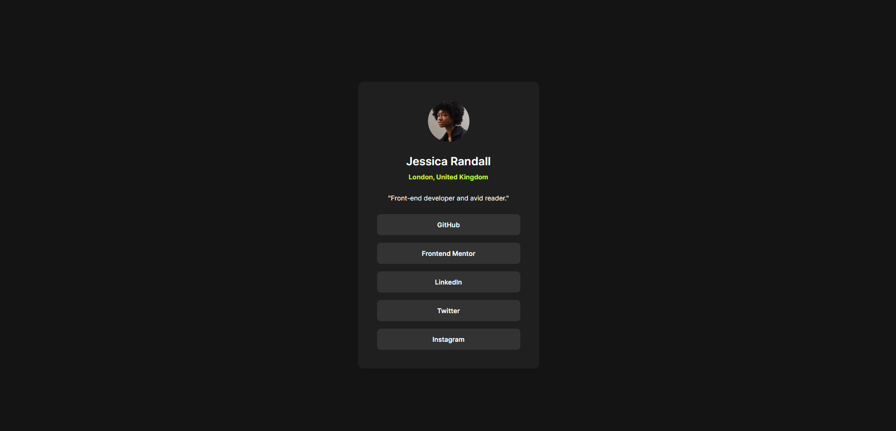

# Frontend Mentor - Social links profile solution

This is a solution to the [Social links profile challenge on Frontend Mentor](https://www.frontendmentor.io/challenges/social-links-profile-UG32l9m6dQ). Frontend Mentor challenges help you improve your coding skills by building realistic projects.

## Table of contents

- [Overview](#overview)
  - [The challenge](#the-challenge)
  - [Screenshot](#screenshot)
  - [Links](#links)
- [My process](#my-process)
  - [Built with](#built-with)
  - [What I learned](#what-i-learned)
  - [Continued development](#continued-development)
  - [Useful resources](#useful-resources)
- [Author](#author)

## Overview

### The challenge

Users should be able to:

- See hover and focus states for all interactive elements on the page

### Screenshot

### Links

- Solution URL: [Solution](https://github.com/kalihari90/frontend-mentor-3)
- Live Site URL: [Live](https://kalihari90.github.io/frontend-mentor-3/)

## My process

### Built with

- Semantic HTML5 markup
- CSS custom properties
- Flexbox

### What I learned

There was nothing new on this project. I practiced reading values from figma file to make my project as perfect as possible. I think I'm very close to be pixel perfect. I'm proud of myself, because this project didn't take much time. I'm coding faster but unfortunatetly I don't practics regularly yet.

### Continued development

I'm going to do all newbie challenges. One by week so I will finish all of them in few months.

### Useful resources

- [Figma developers guide](https://www.smashingmagazine.com/2020/09/figma-developers-guide/) - This guide helped me to better undersatnd how to use Figma file.

## Author

- Frontend Mentor - [@kalihari90](https://www.frontendmentor.io/profile/kalihari90)
